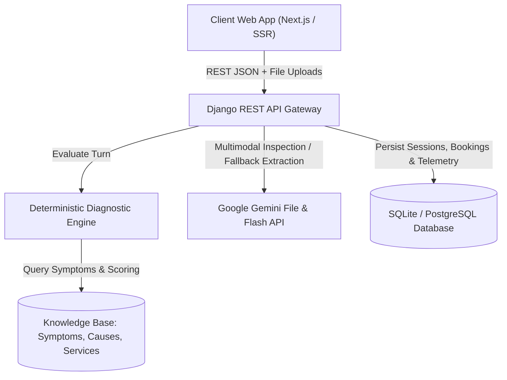
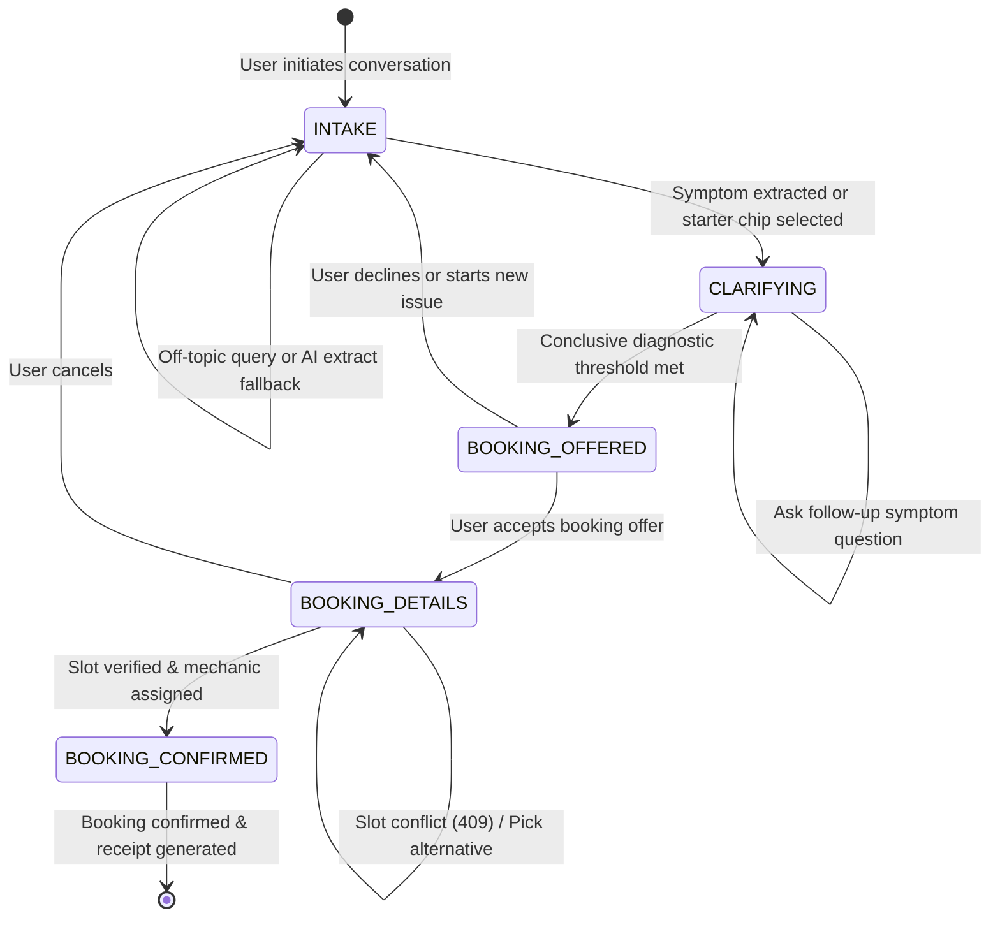
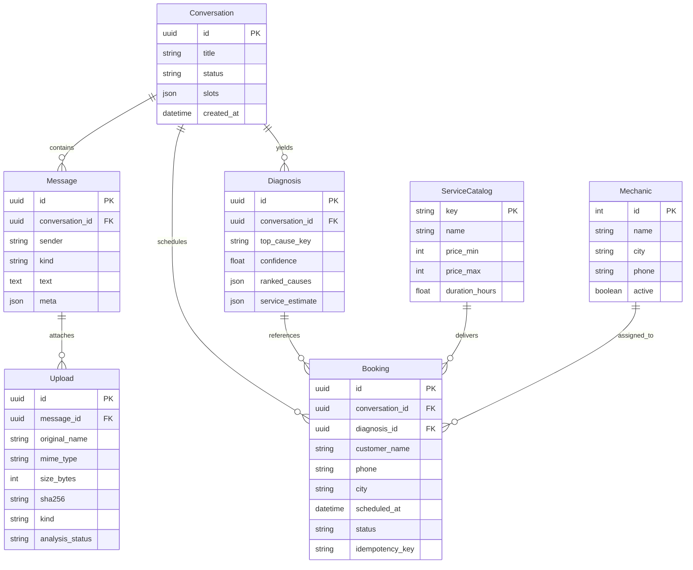

# Architecture & System Design

## 1. System Topology

```mermaid
graph TD
    Client["Client Web App (Next.js / SSR)"]
    API["Django REST API Gateway"]
    Engine["Deterministic Diagnostic Engine"]
    KB[("Knowledge Base: Symptoms, Causes, Services")]
    AI["Google Gemini File & Flash API"]
    DB[("SQLite / PostgreSQL Database")]

    Client -->|REST JSON + File Uploads| API
    API -->|Evaluate Turn| Engine
    Engine -->|Query Symptoms & Scoring| KB
    API -->|Multimodal Inspection / Fallback Extraction| AI
    API -->|Persist Sessions, Bookings & Telemetry| DB
```

---

## 2. Conversation Flow State Machine

```mermaid
stateDiagram-v2
    [*] --> INTAKE : User initiates conversation
    INTAKE --> CLARIFYING : Symptom extracted or starter chip selected
    INTAKE --> INTAKE : Off-topic query or AI extract fallback

    CLARIFYING --> CLARIFYING : Ask follow-up symptom question
    CLARIFYING --> BOOKING_OFFERED : Conclusive diagnostic threshold met

    BOOKING_OFFERED --> BOOKING_DETAILS : User accepts booking offer
    BOOKING_OFFERED --> INTAKE : User declines or starts new issue

    BOOKING_DETAILS --> BOOKING_CONFIRMED : Slot verified & mechanic assigned
    BOOKING_DETAILS --> BOOKING_DETAILS : Slot conflict (409) / Pick alternative
    BOOKING_DETAILS --> INTAKE : User cancels

    BOOKING_CONFIRMED --> [*] : Booking confirmed & receipt generated
```

---

## 3. Entity-Relationship Diagram (ERD)

```mermaid
erDiagram
    Conversation ||--o{ Message : contains
    Conversation ||--o{ Diagnosis : yields
    Conversation ||--o{ Booking : schedules
    Message ||--o{ Upload : attaches
    Diagnosis ||--o{ Booking : references
    ServiceCatalog ||--o{ Booking : delivers
    Mechanic ||--o{ Booking : assigned_to

    Conversation {
        uuid id PK
        string title
        string status
        json slots
        datetime created_at
    }

    Message {
        uuid id PK
        uuid conversation_id FK
        string sender
        string kind
        text text
        json meta
    }

    Upload {
        uuid id PK
        uuid message_id FK
        string original_name
        string mime_type
        int size_bytes
        string sha256
        string kind
        string analysis_status
    }

    Diagnosis {
        uuid id PK
        uuid conversation_id FK
        string top_cause_key
        float confidence
        json ranked_causes
        json service_estimate
    }

    Booking {
        uuid id PK
        uuid conversation_id FK
        uuid diagnosis_id FK
        string customer_name
        string phone
        string city
        datetime scheduled_at
        string status
        string idempotency_key
    }

    Mechanic {
        int id PK
        string name
        string city
        string phone
        boolean active
    }

    ServiceCatalog {
        string key PK
        string name
        int price_min
        int price_max
        float duration_hours
    }
```
